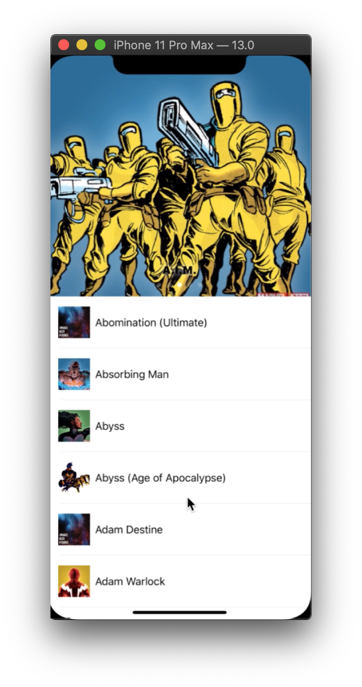
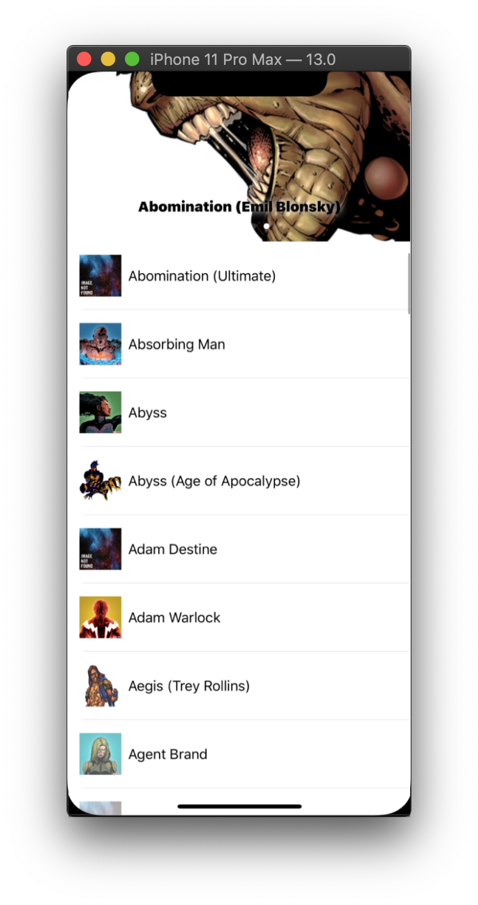

# Marvel List
[](https://img.shields.io/badge/language-Swift-orange.svg) [](https://img.shields.io/badge/platform-iOS-lightgrey.svg)
# Description
See all the Marvel heroes by alphabetical order!
|   |   |   |
|---|---|---|
||||
|   |   |   |

# Requirements
-   Xcode 11.0+
-   iOS 11.0+
-   Swift 5.0+

# Features
  - List all Marvel characters with Infinite Scroll;
  - You only need to request them once. The heroes and images will be available offline on yout device!
  
# API Keys
Generate your API Keys in the [Marvel Portal](https://developer.marvel.com).

Set your keys in `Constants.swift` file:
`MarvelList/Constants/Constants.swift`

````swift
enum Constants {
    enum API {
        static let baseURL = "https://gateway.marvel.com/v1/public/characters"
        static let publicKey = "YOUR_KEY"
        static let privateKey = "YOUR_KEY"
    }
...
````
# Installation  
### Carthage 
 [Carthage](https://github.com/Carthage/Carthage) is a dependencies administrator tool. After installed, run the following command:
```console
$ carthage update
```
Then manually add the generated ```.framework``` builds to the project. 

For now, we are embeding the libraries  in   ``` Project > Targets > Frameworks, Libraries, and Embedded Content ```, using the option  ``` Embed Without Signing ```


## Libraries
- [Snapkit](https://github.com/SnapKit/SnapKit)
- [SDWebImage](https://github.com/rs/SDWebImage)
- [lottie](https://github.com/airbnb/lottie-ios)

## Project Roadmap

- To generate a  ```.sh ``` script for automatically embed the libraries
- To create a modal Details screen using - [Hero](https://github.com/HeroTransitions/Hero) as image transition
